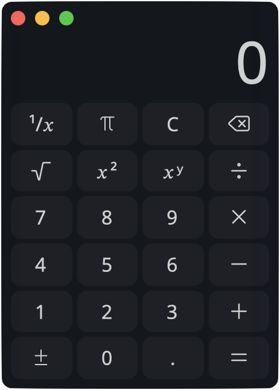

# 
GPUI Calculator

World's worst calculator, made with <a href="https://github.com/zed-industries/zed/tree/main/crates/gpui">GPUI</a>.

## Key GPUI features used

* Keybinds for calculator inputs and operations
* Dynamic text sizing for the calculator display
* Embedded icons and fonts loaded as assets
* Event signalling between the calculator state and the UI
* Native-looking title bar on macOS and Windows

This is just a practice project to learn how to use GPUI and test out their latest changes.
